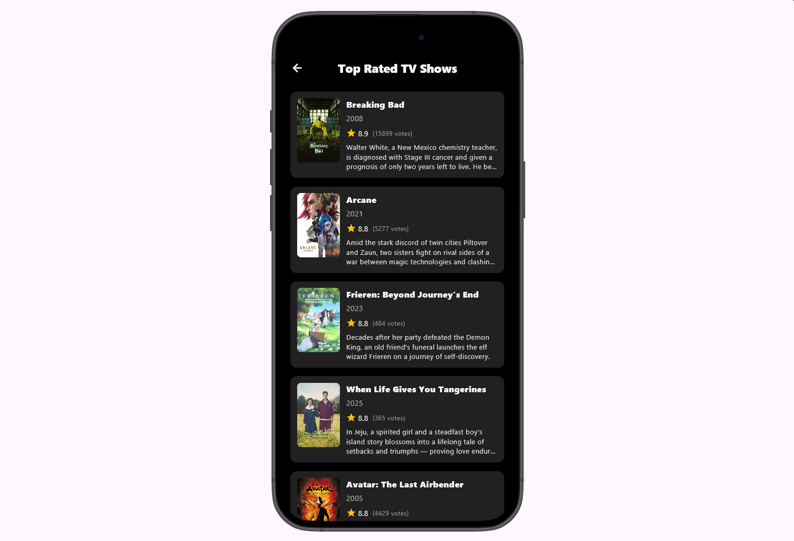

# 🎬 Filmah - Movie & TV Show Discovery App

A modern Flutter application for discovering and exploring movies and TV shows. Built with clean architecture principles and powered by The Movie Database (TMDb) API.

## 📱 Features

### 🎥 Movies Section

- **Now Playing Movies**: Carousel slider showing currently playing movies with auto-play functionality
- **Popular Movies**: Horizontal scrollable list of trending movies
- **Top Rated Movies**: Display of highest-rated movies
- **Movie Details**: Comprehensive movie information including ratings, overview, and cast details
- **Browse All**: Dedicated screens for browsing complete lists of popular and top-rated movies

### 📺 TV Shows Section

- **Popular TV Shows**: Discover trending television series
- **Top Rated TV Shows**: Browse highest-rated TV shows
- **TV Show Details**: Detailed information about episodes, seasons, and cast
- **Browse All**: Full-screen browsing experience for TV show categories

### 🎨 User Experience

- **Dark Theme**: Sleek black background with red accent colors
- **Smooth Animations**: Fade-in animations and carousel transitions
- **Loading States**: Shimmer loading effects for better user experience
- **Error Handling**: Graceful error handling with retry functionality
- **Pull to Refresh**: Refresh content with pull-down gesture
- **Responsive Design**: Optimized for different screen sizes
- **Cached Images**: Fast image loading with caching support

## 🏗️ Architecture

This project follows **Clean Architecture** principles with clear separation of concerns:

```
lib/
├── core/                          # Core application components
│   ├── dependency_injection/      # Dependency injection setup
│   ├── helpers/                   # Utility functions and enums
│   ├── network/                   # API configuration and constants
│   ├── routes/                    # Navigation and routing
│   ├── themes/                    # App theming and styles
│   └── widgets/                   # Reusable UI components
├── features/                      # Feature-based modules
│   ├── movies/                    # Movie-related functionality
│   │   ├── data/                  # Data layer (API, models)
│   │   ├── domain/                # Business logic layer
│   │   └── ui/                    # Presentation layer
│   └── tv_shows/                  # TV show functionality
│       ├── data/                  # Data layer
│       ├── domain/                # Business logic layer
│       └── ui/                    # Presentation layer
└── main.dart                      # Application entry point
```

## 🛠️ Technical Stack

### Core Dependencies

- **State Management**: Flutter Riverpod for reactive state management
- **Navigation**: Flutter's built-in navigation system
- **HTTP Client**: Dio for API requests with pretty logging
- **Caching**: Cached Network Image for efficient image loading
- **Animations**: Animate Do for smooth UI transitions

### UI/UX Libraries

- **Responsive Design**: Flutter ScreenUtil for adaptive layouts
- **Typography**: Google Fonts for custom font styling
- **Loading Effects**: Shimmer for skeleton loading screens
- **Carousels**: Carousel Slider for image galleries
- **Icons**: Cupertino Icons for iOS-style iconography

### Data & Storage

- **Local Storage**: Shared Preferences for app settings
- **Environment Config**: Flutter DotEnv for environment variables
- **Database**: Supabase Flutter for backend services

### Development Tools

- **Code Generation**: Freezed and JSON Annotation for immutable models
- **API Client**: Retrofit for type-safe API calls
- **Network Monitoring**: Internet Connection Checker
- **Architecture Support**: Equatable and Dartz for functional programming

## 🚀 Getting Started

### Prerequisites

- Flutter SDK (3.8.1 or higher)
- Dart SDK
- Android Studio / VS Code
- TMDb API Key (free registration at [themoviedb.org](https://www.themoviedb.org))

### Installation

1. **Clone the repository**

   ```bash
   git clone <repository-url>
   cd filmah
   ```

2. **Install dependencies**

   ```bash
   flutter pub get
   ```

3. **Set up environment variables**
   Create a `.env` file in the root directory:

   ```properties
   API_KEY=your_tmdb_api_key_here
   BASE_URL=https://api.themoviedb.org/3
   ```

4. **Run the app**
   ```bash
   flutter run
   ```

### Build for Production

**Android**

```bash
flutter build apk --release
```

**iOS**

```bash
flutter build ios --release
```

## 📸 Screenshots

### 🎥 Movies Section
<div align="center">
  
</div>

*Main movies screen featuring now playing carousel, popular movies, and top rated sections*

### 🎬 Movie Details & Browse
<div align="center">
    
  
    
    
</div>

*Detailed movie information and full browsing experience*

### 📺 TV Shows Section
<div align="center">
  
   
    
  
</div>

*TV shows discovery and detailed information screens*

### 🎨 User Experience Features
<div align="center">
  
</div>

*Loading effects, error states, and interactive features*

## 🔧 Configuration

### API Configuration

The app uses The Movie Database (TMDb) API. Update the `.env` file with your API credentials:

- Get your free API key from [TMDb](https://www.themoviedb.org/settings/api)
- Add the API key to your `.env` file

### Theme Customization

Modify theme settings in `lib/core/themes/app_theme.dart`:

- Colors and styling
- Dark/light theme configurations
- Font families and sizes

## 🤝 Contributing

1. Fork the repository
2. Create a feature branch (`git checkout -b feature/amazing-feature`)
3. Commit your changes (`git commit -m 'Add amazing feature'`)
4. Push to the branch (`git push origin feature/amazing-feature`)
5. Open a Pull Request

## 📄 License

This project is licensed under the MIT License - see the [LICENSE](LICENSE) file for details.

## 🙏 Acknowledgments

- [The Movie Database (TMDb)](https://www.themoviedb.org) for providing the comprehensive movie and TV show API
- Flutter team for the amazing framework
- All the open-source packages contributors

## 📞 Support

If you encounter any issues or have suggestions for improvements, please:

1. Check the [Issues](../../issues) page for existing problems
2. Create a new issue with detailed information
3. Provide steps to reproduce any bugs

---

**Built with ❤️ by [Ahmed Waheed](https://github.com/ahmed-waheed1) using Dart**

## Author 👨‍💻

**Ahmed Waheed** - [@ahmed-waheed1](https://github.com/ahmed-waheed1)

- 📧 Email: [Contact Me](mailto:ahmedwaheed4047@gmail.com)
- 💼 LinkedIn: [Ahmed Waheed](https://www.linkedin.com/in/ahmed-waheed11/)
- 🐱 GitHub: [@ahmed-waheed1](https://github.com/ahmed-waheed1)

---

**Note**: This app is for educational purposes and uses TMDb API. Make sure to comply with TMDb's terms of service when using their API.
